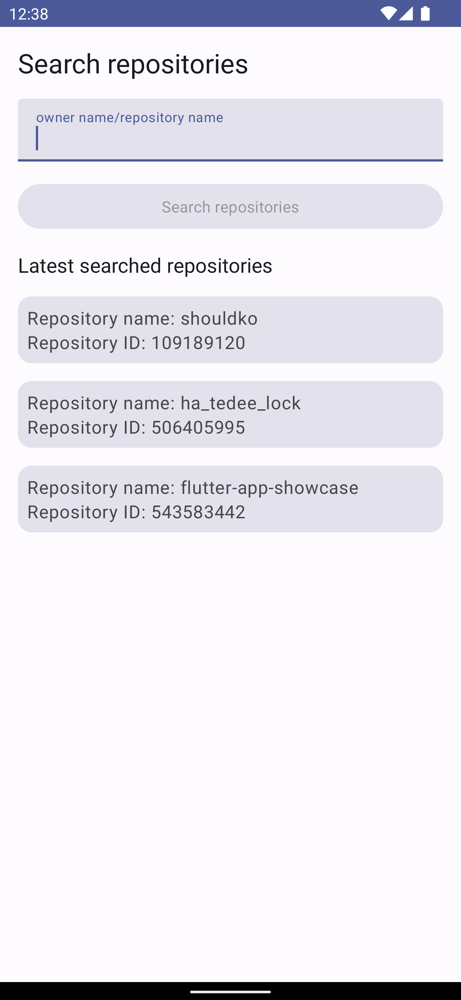
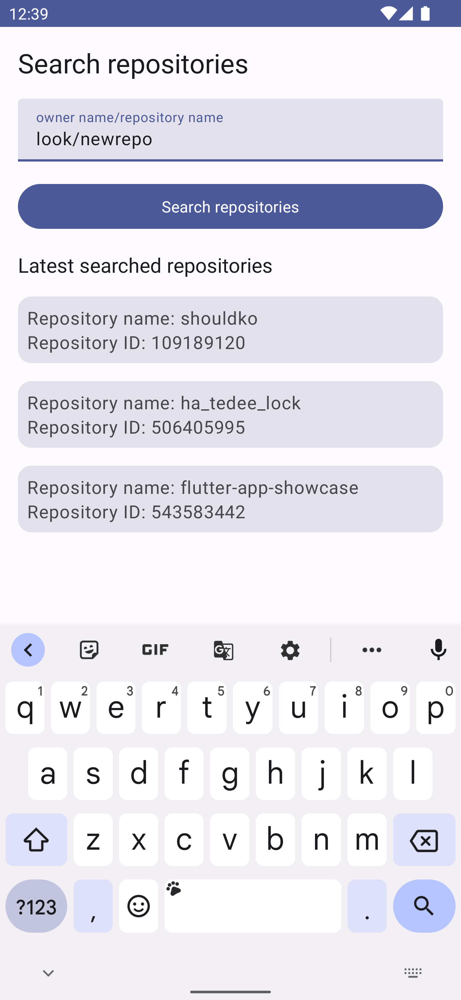
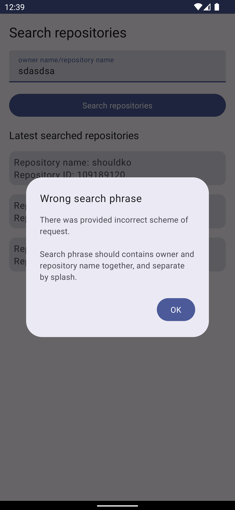
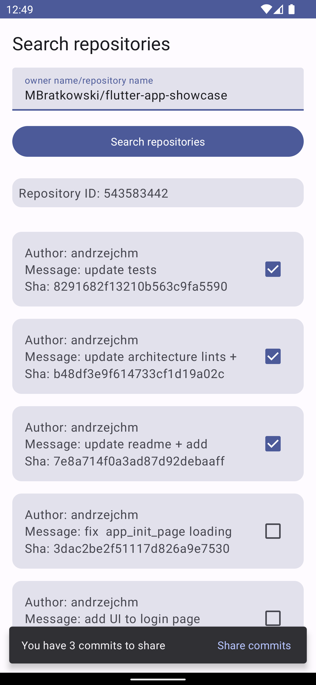
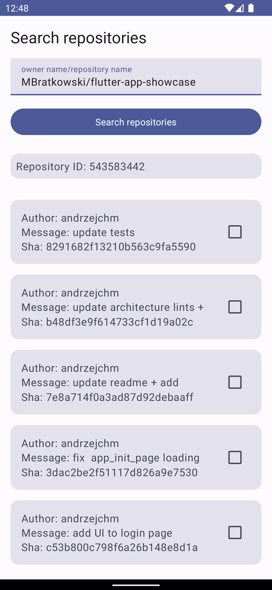

## Readme of Github Repository Project

### Information about the project

This project is a sample project to verify skills.

## Assigment

```TEXT
1. It allows user to input a GitHub repository name in the following format: “<owner>/<repository>“, e.g. “bright/shouldko”.
2. When the repository name is provided, the app fetches and displays the following information about it using GitHub API:
    1. repository ID,
    2. the list of the commits in the repository:
        1. each commit should be described by: message, SHA value, author’s name;
        2. the list should be sorted by date so that the latest commits are at the top (just like on GitHub).
3. The app caches the previously used repositories data.
    1. The user can access the history of last used repositories.
        1. Using the history, the user can open the repository information again in the same way as if he typed the repository name manually again (see: 1.)
    2. When the app is offline, the user should still be able to see the previously fetched repository information.
4. User can send the selected commits’ data (message, SHA value, author’s name) using 3rd party application installed on the phone (e.g. an e-mail client or Facebook Messenger) in the following way:
    1. the commits on the list can be selected and unselected,
    2. user selects at least one commit on the list,
    3. user taps a “send” button,
    4. user is asked by the system to choose an application he wants to use for sending a message,
    5. a new message in the selected app already contains passed commits’ information so that the user does not have to copy-paste it manually.

```

## How to launch

To build the app you need to create an `api.properties` file in the project's root, and put
the `apiKey` variable with your apiKey from `Github`.

## Android Stack

- **Kotlin** - primary language
- **Coroutines** - concurrency
- **StateFlow** - keeping app state
- **SharedFlow** - emit one single event
- **Jetpack Compose** - build UI
- **Material3** - style app
- **ViewModel** - container for everything
- **Room** - database
- **Dagger Hilt** - dependency injection
- **Gson** - parsing JSON
- **Retrofit** - making a REST request
- **OkHTTP** - manage headers

## Modules Structure

- **app** - main app module, all DI modules are added here.
- **core-designSystem** - contains base theme with support for dark theme and basic components which
  are wrapping common use cases.
- **core-data** - implementation of the DataSource from **core-data-api**. Here is connected a
  network and local data layers.
- **core-data-api** - contains models.
- **core-data-local** - responsible for the local data layer - here is a Room implementation
- **core-data-network** - responsible for the network data layer - here is a Retrofit implementation
- **feature-searchRepositoreis** - place where all code related to application features is located.

## Feature structure

- **usecases** - classes which take care to make a request to the data layer and handle or make base
  validation.
- **util** - a bunch of classes that are taking responsibility for one thing.
- **dialogs** - a class containing all dialogs related to this feature.
- ViewModel/ViewEffect/ViewEvent - logic and events

## What can be improved

- **Dependency management** - right now in multi-module applications we reuse the same dependencies
  in different modules - managing it in the future will be painful. Good practice to prevent this
  kind of situation by using **Gradle Version Catalog** and keeping all dependencies there.
- **Navigation** - right now the application has one screen. In a good implementation, there should
  be two separate screens - one screen to display commits and a second to launch search and
  information about the latest searches.
- **Error handling and parsing** - this logic should be delegated to some kind of special error
  parser.
- **More unit test** - I didn't have enough time to test all classes, especially ViewModel

## Screenshots

| Column 1                                    | Column 2                                         | Column 3                                       |
|:--------------------------------------------|:-------------------------------------------------|:-----------------------------------------------|
|       |  |     |
|  |     |  |
